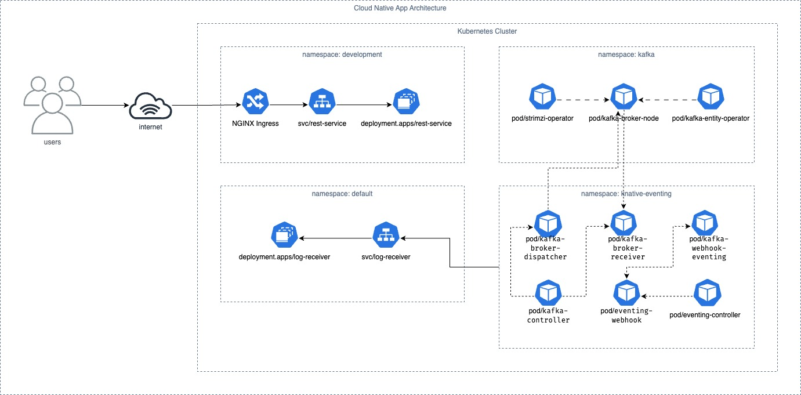

# cloud-native-app-demo

This repository contains a demo of a cloud-native application using Knative Eventing and Apache Kafka for event-driven architecture and Ingress NGINX for routing HTTP traffic to the REST services.



## Create local K8s cluster with Kind

To create a local K8s cluster with [Kind](https://kind.sigs.k8s.io/docs/user/quick-start/), run the following command:

```shell
$ kind create cluster --config kind-config.yaml
```

## REST Services

### Install ingress NGINX

Run the following command to install the NGINX Ingress Controller:

```shell
$ kubectl apply -f https://raw.githubusercontent.com/kubernetes/ingress-nginx/main/deploy/static/provider/kind/deploy.yaml
```

The manifests contains kind specific patches to forward the hostPorts to the ingress controller, set taint tolerations and schedule it to the custom labelled node.

Now the Ingress is all setup. Wait until is ready to process requests running:

```shell
$ kubectl wait --namespace ingress-nginx \
  --for=condition=ready pod \
  --selector=app.kubernetes.io/component=controller \
  --timeout=90s
```

### Deploy the application

Create the namespace and deploy the application:

```shell
$ kubectl create namespace development
```

To deploy rest-service app, run the following command:

```shell
$ cd rest-service && \
  skaffold run -p development && \
  cd ..
```

Then create the ingress:

```shell
$ cd ingress && \
  kubectl kustomize overlays/development | kubectl apply -f - && \
  cd ..
```

## Knative Eventing - The Event-driven application platform for Kubernetes

Knative Eventing is a collection of APIs that enable you to use an [event-driven architecture](https://en.wikipedia.org/wiki/Event-driven_architecture) with your applications. You can use these APIs to create components that route events from event producers (known as sources) to event consumers (known as sinks) that receive events. Sinks can also be configured to respond to HTTP requests by sending a response event.

Knative Eventing is a standalone platform that provides support for various types of workloads, including standard Kubernetes Services and Knative Serving Services.

Knative Eventing uses standard HTTP POST requests to send and receive events between event producers and sinks. These events conform to the [CloudEvents specifications](https://cloudevents.io/), which enables creating, parsing, sending, and receiving events in any programming language.

#### Install Knative Eventing Core

To install [Knative](https://knative.dev/docs/install/yaml-install/) Eventing:

1. Install the required custom resource definitions (CRDs) by running the command:

```shell
$ kubectl apply -f https://github.com/knative/eventing/releases/download/knative-v1.13.2/eventing-crds.yaml
```

2. Install the core components of Eventing by running the command:

```shell
$ kubectl apply -f https://github.com/knative/eventing/releases/download/knative-v1.13.2/eventing-core.yaml
```

Verify the installation by running the command:

```shell
$ kubectl get pods -n knative-eventing
NAME                                   READY   STATUS    RESTARTS   AGE
eventing-controller-68fb776c69-g4fl6   1/1     Running   0          48s
eventing-webhook-664866f89f-knrr7      1/1     Running   0          48s
```

#### Knative Eventing [Broker](https://knative.dev/docs/eventing/brokers/broker-types/kafka-broker/)

Brokers are Kubernetes custom resources that define an event mesh for collecting a pool of events. Brokers provide a discoverable endpoint for event ingress, and use Triggers for event delivery. Event producers can send events to a broker by POSTing the event.


The following commands install the Apache Kafka Broker and run event routing in a system namespace. The `knative-eventing` namespace is used by default.

1. Install the Kafka controller by running the following command:

```shell
$ kubectl apply -f https://github.com/knative-extensions/eventing-kafka-broker/releases/download/knative-v1.13.4/eventing-kafka-controller.yaml
```

2. Install the Kafka Broker data plane by running the following command:

```shell
$ kubectl apply -f https://github.com/knative-extensions/eventing-kafka-broker/releases/download/knative-v1.13.4/eventing-kafka-broker.yaml
```

3. Verify that `kafka-controller`, `kafka-broker-receiver` and `kafka-broker-dispatcher` are running, by entering the following command:

```shell
$ kubectl get deployments.apps -n knative-eventing
NAME                      READY   UP-TO-DATE   AVAILABLE   AGE
eventing-controller       1/1     1            1           12m
eventing-webhook          1/1     1            1           12m
kafka-broker-dispatcher   1/1     1            1           2m31s
kafka-broker-receiver     1/1     1            1           2m31s
kafka-controller          1/1     1            1           9m52s
kafka-webhook-eventing    1/1     1            1           9m52s
pingsource-mt-adapter     0/0     0            0           12m
```

#### Setting up Apache Kafka with Strimzi on Kubernetes

In order to create an Apache Kafka cluster on your development environment, such as kind or minikube, you need to install the Strimzi operator first:

```shell
$ kubectl create namespace kafka
$ kubectl create -f 'https://strimzi.io/install/latest?namespace=kafka' -n kafka
```

Verify that the Strimzi operator is running by entering the following command:

```shell
$ kubectl get pods -n kafka
NAME                                        READY   STATUS    RESTARTS   AGE
strimzi-cluster-operator-7bb5468c59-whqz5   1/1     Running   0          34s
```

Once that happened you need to patch the Deployment of the Operator to enable the required FeatureGates:

```shell
$ kubectl -n kafka set env deployment/strimzi-cluster-operator STRIMZI_FEATURE_GATES=+KafkaNodePools,+UseKRaft
```

Then, create a Kafka cluster by applying the following configuration:

```yaml
apiVersion: kafka.strimzi.io/v1beta2
kind: KafkaNodePool
metadata:
  name: pool-01
  namespace: kafka
  labels:
    strimzi.io/cluster: kafka-01
spec:
  replicas: 1
  roles:
    - controller
    - broker
  storage:
    type: jbod
    volumes:
      - id: 0
        type: persistent-claim
        size: 10Gi
        deleteClaim: false
  resources:
    requests:
      memory: 1Gi
      cpu: 500m
    limits:
      memory: 1Gi
      cpu: "1"
  jvmOptions:
    -Xms: 500m
    -Xmx: 500m
---
apiVersion: kafka.strimzi.io/v1beta2
kind: Kafka
metadata:
  name: kafka-01
  namespace: kafka
  annotations:
    strimzi.io/kraft: enabled
    strimzi.io/node-pools: enabled
spec:
  kafka:
    version: 3.6.1
    metadataVersion: 3.6-IV2
    # The replicas field is required by the Kafka CRD schema while the KafkaNodePools feature gate is in alpha phase.
    # But it will be ignored when Kafka Node Pools are used
    replicas: 1
    logging:
      type: inline
      loggers:
        kafka.root.logger.level: INFO
    readinessProbe:
      initialDelaySeconds: 15
      timeoutSeconds: 5
    livenessProbe:
      initialDelaySeconds: 15
      timeoutSeconds: 5
    listeners:
      - name: plain
        port: 9092
        type: internal
        tls: false
      - name: tls
        port: 9093
        type: internal
        tls: true
    config:
      offsets.topic.replication.factor: 1
      transaction.state.log.replication.factor: 1
      transaction.state.log.min.isr: 1
      default.replication.factor: 1
      min.insync.replicas: 1
      inter.broker.protocol.version: "3.6"
    # The storage field is required by the Kafka CRD schema while the KafkaNodePools feature gate is in alpha phase.
    # But it will be ignored when Kafka Node Pools are used
    storage:
      type: jbod
      volumes:
        - id: 0
          type: persistent-claim
          size: 10Gi
          deleteClaim: false
  # The ZooKeeper section is required by the Kafka CRD schema while the UseKRaft feature gate is in alpha phase.
  # But it will be ignored when running in KRaft mode
  zookeeper:
    replicas: 1
    storage:
      type: persistent-claim
      size: 10Gi
      deleteClaim: false
  entityOperator:
    userOperator: {}
```

> NOTE: The `Kafkas.kafka.strimzi.io` CR currently does require you describe the `zookeeper` field, but it is ignored when the `UseKRaft` FeatureGate is enabled.

Apply the configuration by running the following command:

```shell
$ kubectl apply -f kafka-cluster.yaml
```

To list the Kafka cluster, run the following command:

```shell
$ kubectl get k -n kafka
NAME       DESIRED KAFKA REPLICAS   DESIRED ZK REPLICAS   READY   WARNINGS
kafka-01   1                        1                     True    True
```

Verify that the Kafka cluster is running by entering the following command:

```shell
$ kubectl get pods -n kafka
NAME                                        READY   STATUS    RESTARTS      AGE
kafka-01-entity-operator-54f5f497fd-m92bn   1/1     Running   0             4m4s
kafka-01-pool-01-0                          1/1     Running   0             4m30s
strimzi-cluster-operator-fb7bf5c8f-bsq42    1/1     Running   1 (43s ago)   35m
```

#### Set as default broker implementation

To set the Kafka broker as the default implementation for all brokers in the Knative deployment, you can apply global settings by modifying the `config-br-defaults` ConfigMap in the `knative-eventing` namespace.

This allows you to avoid configuring individual or per-namespace settings for each broker, such as `metadata.annotations.eventing.knative.dev/broker.class` or `spec.config`.

```yaml
apiVersion: v1
kind: ConfigMap
metadata:
  name: kafka-broker-config
  namespace: knative-eventing
data:
  # Number of topic partitions
  default.topic.partitions: "10"
  # Replication factor of topic messages.
  default.topic.replication.factor: "1"
  # A comma separated list of bootstrap servers. (It can be in or out the k8s cluster)
  bootstrap.servers: "kafka-01-kafka-bootstrap.kafka:9092"
---
apiVersion: v1
kind: ConfigMap
metadata:
  name: config-br-defaults
  namespace: knative-eventing
data:
  default-br-config: |
    clusterDefault:
      brokerClass: Kafka
      apiVersion: v1
      kind: ConfigMap
      name: kafka-broker-config
      namespace: knative-eventing
```

Apply the configuration by running the following command:

```shell
$ kubectl apply -f kafka-broker-config.yaml
```

#### Create a Knative Kafka Broker

First we're going to modified `bootstrap.servers` field on `kafka-broker-config` and `kafka-channel-config` ConfigMaps that created by [eventing-kafka-controller.yaml](https://github.com/knative-extensions/eventing-kafka-broker/releases/download/knative-v1.13.4/eventing-kafka-controller.yaml) we apply above.

Run the following command to edit the config and change the `bootstrap.servers` value from `my-cluster-kafka-bootstrap.kafka:9092` to `kafka-01-kafka-bootstrap.kafka:9092`:

```shell
$ kubectl edit configmap kafka-broker-config -n knative-eventing
$ kubectl edit configmap kafka-channel-config -n knative-eventing
```

A Kafka Broker object looks like this:

```yaml
apiVersion: eventing.knative.dev/v1
kind: Broker
metadata:
  name: default
  namespace: default
spec: {}
```

To create a Kafka Broker, run the following command:

```shell
$ kubectl apply -f kafka-broker.yaml
```

A minimum resource was created on the cluster, representing a Knative Kafka broker object:

```shell
$ kubectl get brokers.eventing.knative.dev
NAME      URL                                                                              AGE   READY   REASON
default   http://kafka-broker-ingress.knative-eventing.svc.cluster.local/default/default   36s   True
```

#### Run Debug Tests

##### Create Trigger

Setting a debug trigger to receive the CloudEvents sent to the broker.

```yaml
apiVersion: v1
kind: Service
metadata:
  name: log-receiver
spec:
  selector:
    app: log-receiver
  ports:
    - port: 80
      protocol: TCP
      targetPort: log-receiver
      name: http
---
apiVersion: v1
kind: Pod
metadata:
  name: log-receiver
  labels:
    app: log-receiver
spec:
  containers:
    - name: log-receiver
      image: quay.io/openshift-knative/knative-eventing-sources-event-display
      imagePullPolicy: Always
      ports:
        - containerPort: 8080
          protocol: TCP
          name: log-receiver
      resources:
        requests:
          cpu: 100m
          memory: 64Mi
        limits:
          cpu: 100m
          memory: 128Mi
---
apiVersion: eventing.knative.dev/v1
kind: Trigger
metadata:
  name: log-trigger
spec:
  broker: default
  subscriber:
    ref:
      apiVersion: v1
      kind: Service
      name: log-receiver
```

Apply the configuration by running the following command:

```shell
$ kubectl apply -f log-receiver.yaml
```

##### Sending CloudEvents to the Broker

With `curl` you can easily send a CloudEvent to the broker.

The broker is accessible via the `kafka-broker-ingress` service in the `knative-eventing` namespace, and for simplicity we can enable `port-forward` to access it via `localhost`:

```shell
$ kubectl -n knative-eventing port-forward service/kafka-broker-ingress 8080:80
```

Now perform a `curl`:

```shell
$ curl -v -X POST \
    -H "content-type: application/json"  \
    -H "ce-specversion: 1.0"  \
    -H "ce-source: curl-command"  \
    -H "ce-type: curl.demo"  \
    -H "ce-myextension: super-duper-ce-extension"  \
    -H "ce-id: 123-abc"  \
    -d '{"message":"Hello World"}' \
    http://localhost:8080/default/default
```

##### Trigger filtering

Exact match filtering on any number of CloudEvents attributes as well as extensions are supported. If your filter sets multiple attributes, an event must have all of the attributes for the trigger to filter it. Note that it only support exact matching on string values.

The Trigger API defines a [powerful set of filters](https://knative.dev/docs/eventing/triggers/) to route CloudEvents based on their metadata:

```yaml
apiVersion: eventing.knative.dev/v1
kind: Trigger
metadata:
  name: log-trigger
spec:
  broker: my-demo-kafka-broker
  filter:
    attributes:
      type: <cloud-event-type>
      <ce-extension>: <ce-extension-value>
  subscriber:
    ref:
      apiVersion: v1
      kind: Service
      name: log-receiver
```

We see a Trigger that defines a set of `filter` rules, if those are matching, the CloudEvent from the Kafka topic is routed, using `HTTP`, to our referenced webserver application.

For example, to filter on the `ce-type` and `ce-myextension` attributes, you can create a trigger like this:

```yaml
apiVersion: eventing.knative.dev/v1
kind: Trigger
metadata:
  name: log-trigger
spec:
  broker: default
  filter:
    attributes:
      type: curl.demo
      myextension: my-extension-value
  subscriber:
    ref:
      apiVersion: v1
      kind: Service
      name: log-receiver
```

In a Terminal, run the following command to see the logs:

```shell
$ kubectl logs -f pod/log-receiver
```

Try to send a CloudEvent with the `curl` command above, and you will see that the event is not received by the `log-receiver` pod.

Now, send a CloudEvent with the `curl` command below:

```shell
$ curl -v -X POST \
    -H "content-type: application/json"  \
    -H "ce-specversion: 1.0"  \
    -H "ce-source: curl-command"  \
    -H "ce-type: curl.demo"  \
    -H "ce-myextension: my-extension-value"  \
    -H "ce-id: 123-abc"  \
    -d '{"message":"Hello Knative Eventing"}' \
    http://localhost:8080/default/default
```

Now, you will see that the event is received by the `log-receiver` pod.

```shell
$ kubectl logs -f pod/log-receiver
☁️  cloudevents.Event
Validation: valid
Context Attributes,
  specversion: 1.0
  type: curl.demo
  source: curl-command
  id: 123-abc
  datacontenttype: application/json
Extensions,
  knativekafkaoffset: 0
  knativekafkapartition: 6
  myextension: my-extension-value
Data,
  {
    "message": "Hello Knative Eventing"
  }
```
